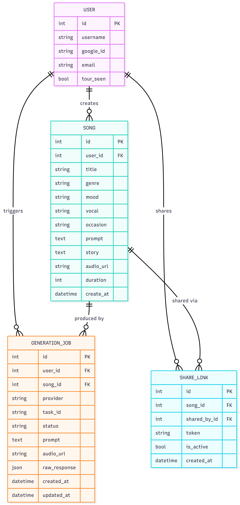
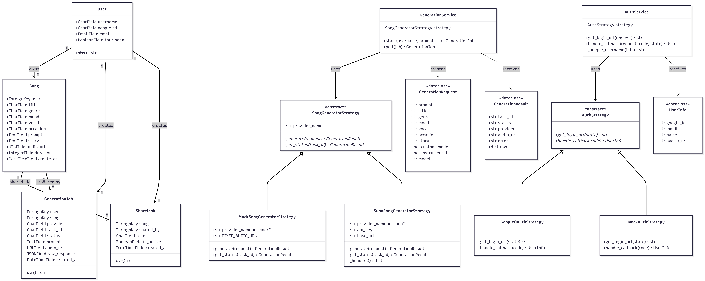
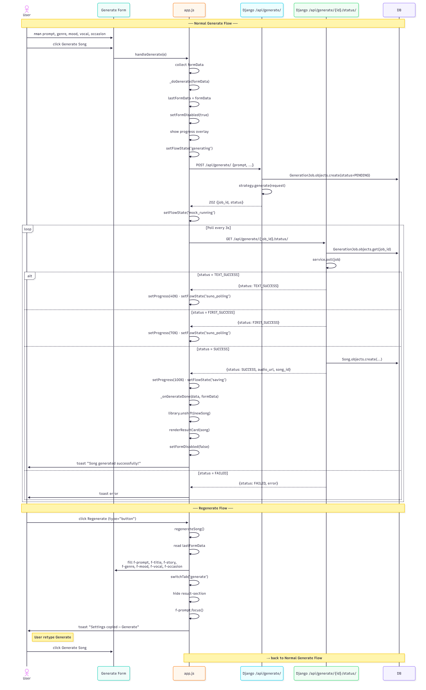
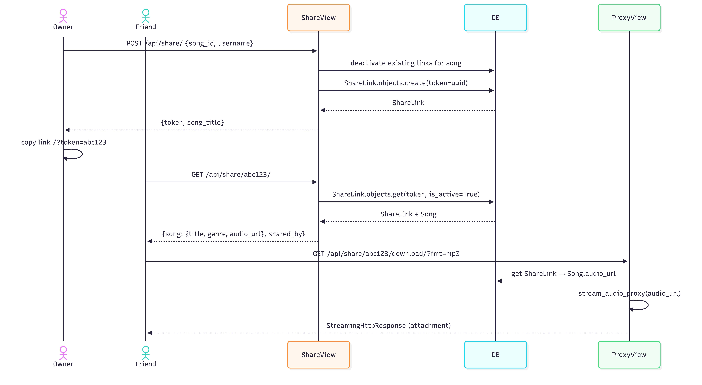

# ♪ Cithara — AI Music Generator

Cithara is a web application that generates music from user prompts using AI (Suno API). Users can log in with Google, generate songs by describing them, preview and download results, and share songs with others via unique links.

---

## Tech Stack

| Layer | Technology |
|---|---|
| Backend | Django 4.x, SQLite |
| Frontend | Vanilla JS, HTML/CSS (served as Django static files) |
| Auth | Google OAuth 2.0 (Strategy Pattern) |
| AI Generation | Suno API (Strategy Pattern) |
| Session | Django session (server-side) |

---

## Requirements

- Python 3.10+
- pip
- A Google OAuth app (Client ID + Secret)
- A Suno API key (optional — use `mock` strategy for local dev)

---

## 1. Clone the Repository

```bash
git clone https://github.com/3393412/Cithara.git
cd Cithara
```

---

## 2. Create & Activate Virtual Environment

**Windows**
```bash
python -m venv venv
venv\Scripts\activate
```

**Mac / Linux**
```bash
python -m venv venv
source venv/bin/activate
```

---

## 3. Install Dependencies

```bash
pip install -r requirements.txt
```

---

## 4. Configure Environment Variables

Create a `.env` file in the project root (same folder as `manage.py`):

```env
# ── Auth Strategy ──────────────────────────────
# "mock"   → bypass Google OAuth (for local dev, auto-login as mock user)
# "google" → real Google OAuth
AUTH_STRATEGY=mock

# Required only when AUTH_STRATEGY=google
GOOGLE_CLIENT_ID=your-google-client-id
GOOGLE_CLIENT_SECRET=your-google-client-secret
GOOGLE_REDIRECT_URI=http://127.0.0.1:8000/auth/callback/

# ── Generation Strategy ────────────────────────
# "mock" → instant offline generation (no API key needed)
# "suno" → real Suno AI generation
GENERATOR_STRATEGY=mock

# Required only when GENERATOR_STRATEGY=suno
SUNO_API_KEY=your-suno-api-key
SUNO_API_BASE_URL=https://api.sunoapi.org/api/v1

# ── Django ─────────────────────────────────────
SECRET_KEY=your-django-secret-key
DEBUG=True
```

> **Quick start for local dev:** keep both strategies as `mock` — no API keys needed.

---

## 5. Setup Database

```bash
python manage.py makemigrations
python manage.py migrate
```

---

## 6. Create Admin Superuser (Optional)

```bash
python manage.py createsuperuser
```

---

## 7. Run the Backend Server

```bash
python manage.py runserver
```

The app (frontend + backend) is served at:
```
http://127.0.0.1:8000/
```

Admin panel:
```
http://127.0.0.1:8000/admin/
```

> The frontend (HTML/CSS/JS) is served as Django static files — no separate frontend server needed.

---

## Project Structure

```
Cithara/
├── Cithara/                  # Django project config
│   ├── settings.py
│   ├── urls.py
│   └── wsgi.py
│
├── song_api/                 # Song & generation app
│   ├── models.py             # Song, GenerationJob
│   ├── views.py              # API endpoints
│   ├── urls.py
│   └── generation/
│       ├── base.py           # Abstract strategy + DTOs
│       ├── factory.py        # Strategy factory
│       ├── service.py        # GenerationService
│       ├── mock.py           # Mock strategy (offline)
│       └── suno.py           # Suno API strategy
│
├── users/                    # Auth app
│   ├── models.py             # User model
│   ├── views.py
│   ├── urls.py
│   └── auth/
│       ├── base.py           # Abstract auth strategy
│       ├── factory.py
│       ├── service.py        # AuthService
│       ├── google.py         # Google OAuth strategy
│       └── mock.py           # Mock auth strategy
│
├── sharing/                  # Share link app
│   ├── models.py             # ShareLink
│   ├── views.py
│   └── urls.py
│
├── frontend/                 # Static frontend
│   ├── index.html
│   ├── app.js
│   └── styles.css
│
├── images/                   # Diagram assets
├── manage.py
├── requirements.txt
└── .env
```

---

## API Endpoints

### Authentication

| Method | Endpoint | Description |
|---|---|---|
| GET | `/auth/login/` | Redirect to OAuth provider |
| GET | `/auth/callback/` | OAuth callback, set session |
| POST | `/auth/logout/` | Flush session |
| GET | `/auth/me/` | Get current user info |
| POST | `/auth/tour-complete/` | Mark interactive tour as seen |

---

### Songs

| Method | Endpoint | Description |
|---|---|---|
| GET | `/api/songs/` | List all songs |
| GET | `/api/songs/?username=john` | List songs by user |
| GET | `/api/songs/?id=1` | Get single song |
| POST | `/api/songs/` | Create song record |
| PUT | `/api/songs/` | Update song |
| DELETE | `/api/songs/` | Delete song |
| GET | `/api/songs/<id>/download/?fmt=mp3` | Download song (proxy stream) |

**POST body (form-data)**
```
username, title, genre, mood, vocal, occasion, prompt, story, path (file)
```

**PUT body (JSON)**
```json
{ "id": 1, "title": "new title", "genre": "rock" }
```

**DELETE body (JSON)**
```json
{ "id": 1 }
```

--- 

### AI Generation

| Method | Endpoint | Description |
|---|---|---|
| POST | `/api/generate/` | Start generation job |
| GET | `/api/generate/<job_id>/status/` | Poll job status |

**POST body (JSON)**
```json
{
  "prompt": "A dreamy shoegaze track with reverb guitar",
  "title": "My Song",
  "genre": "shoegaze",
  "mood": "dark",
  "vocal": "female",
  "occasion": "study",
  "story": "Late night in the city..."
}
```

**Status values:** `PENDING` → `TEXT_SUCCESS` → `FIRST_SUCCESS` → `SUCCESS` / `FAILED`

---

### Sharing

| Method | Endpoint | Description |
|---|---|---|
| POST | `/api/share/` | Create share link for a song |
| GET | `/api/share/<token>/` | Get shared song info |
| GET | `/api/share/<token>/download/?fmt=mp3` | Download shared song |
| DELETE | `/api/share/<token>/deactivate/` | Deactivate share link |

**POST body (JSON)**
```json
{ "song_id": 1, "username": "john" }
```

---

## System Diagrams

### Architecture


The system is organized into three layers: **Browser** (static HTML/JS/CSS), **Django Backend** (three apps: `song_api`, `users`, `sharing`), and **External Services** (Suno AI API and Google OAuth). The frontend communicates via REST API calls. Both the AI generation strategy and authentication strategy are swappable via `.env` configuration without changing any code.

---

### Domain Model



Four core entities make up the data model:
- **User** — authenticated via Google, owns songs and share links
- **Song** — generated audio track with metadata (genre, mood, vocal, occasion)
- **GenerationJob** — tracks the async generation lifecycle from PENDING to SUCCESS
- **ShareLink** — a unique token linking a song to a public share URL

---

### Class Diagram



The backend uses the **Strategy Pattern** in two places:
- `SongGeneratorStrategy` — implemented by `MockSongGeneratorStrategy` and `SunoSongGeneratorStrategy`
- `AuthStrategy` — implemented by `GoogleOAuthStrategy` and `MockAuthStrategy`

Both are managed through a `Service` + `Factory` layer, keeping views decoupled from implementation details. DTOs (`GenerationRequest`, `GenerationResult`, `UserInfo`) prevent strategies from depending on Django ORM directly.

---

### Authentication Flow


Login starts by redirecting the user to Google OAuth. After consent, Google redirects back with an authorization code. Django exchanges the code for user info, then creates or retrieves the `User` record and stores `user_id` in the Django session. On subsequent requests, session middleware handles identity automatically.

---

### Generate Flow



The user submits a prompt and options. The frontend POSTs to `/api/generate/`, which creates a `GenerationJob` and calls the configured strategy. With Suno, the job starts as `PENDING` and the frontend polls `/api/generate/<id>/status/` every 3 seconds. When status reaches `SUCCESS`, a `Song` record is created and the result card is rendered. With Mock strategy, the job completes instantly.

---

### Share Flow



The song owner clicks Share, which calls `POST /api/share/` to generate a unique token. Previous active links for the same song are deactivated. The owner copies the URL (`/?token=<token>`) and shares it. The recipient opens the link, the frontend detects `?token=` in the URL, fetches song metadata from `GET /api/share/<token>/`, and renders a standalone listen/download page — no login required.

---

## Design Patterns

| Pattern | Where Used |
|---|---|
| **Strategy** | `SongGeneratorStrategy` (Mock/Suno), `AuthStrategy` (Google/Mock) |
| **Factory** | `get_strategy()`, `get_auth_strategy()` |
| **Proxy** | `stream_audio_proxy()` — bypasses CORS for audio download |
